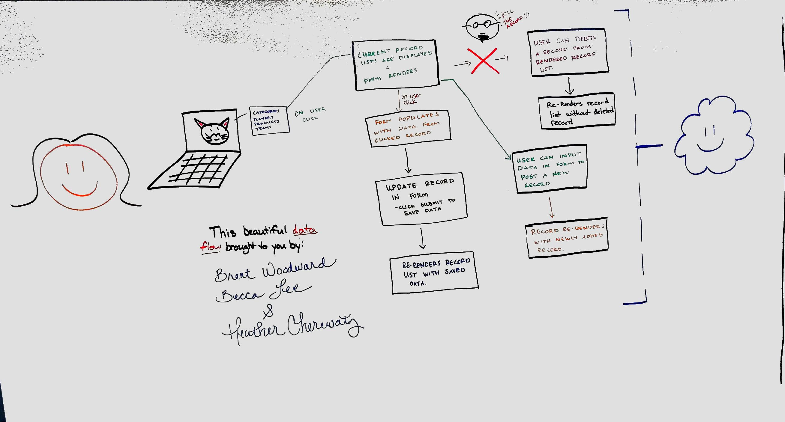
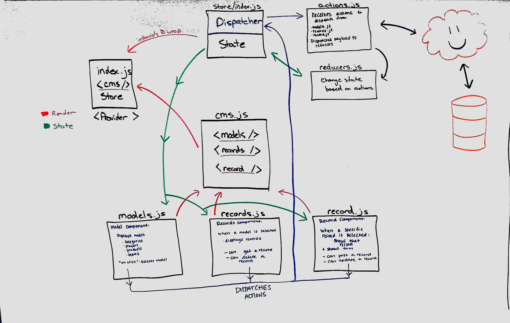

 LAB
=================================================

## Lab 35 CMS

### Author: Brent Woodward

#### Collaborators

### Links and Resources
* [repo](https://github.com/BrentTech/35-project-cms)
* [front-end](https://d324eni7a2v8o8.cloudfront.net) - Blank when CMS not active

### Modules
##### Exported Values and Methods
###### `index.js`
Renders app.js to the DOM, and wraps/serves app with Provider (giving it access to Store)
###### `src/components/cms/cms.js`
Provides render function for base JSX markup and components (Models, Records, and Record)
###### `src/components/cms/models.js`
Component that provides render and functionality of model list based on API information
###### `src/components/cms/actions.js`
Exports actions to reducer within store
###### `src/components/cms/record.js`
Component that provides render and functionality of a web form to user that is populated with selected record information
###### `src/components/cms/reducer.js`
Manages and updates state within the store based on actions.
###### `src/components/cms/records.js`
Component that provides render and functionality of a list to user that is populated with all records information of a given model

###### `src/components/if/index.js - render`
Gates render funcitonality behind conditional logic.
###### `src/components/if/index.js - If`
Provides base If logic to build then/else as needed.
###### `src/components/if/index.js - Then`
If/Then logic for when conditions are true
###### `src/components/if/index.js - Else`
If/Else logic for when conditions are false
###### `src/components/if/index.js - When`
Conditional logic for when condition is true
###### `src/components/if/index.js - Unless`
Conditional logic for when condition is false

#### Tests
* How do you run tests?
* What assertions were made?
* What assertions need to be / should be made?

#### UML

